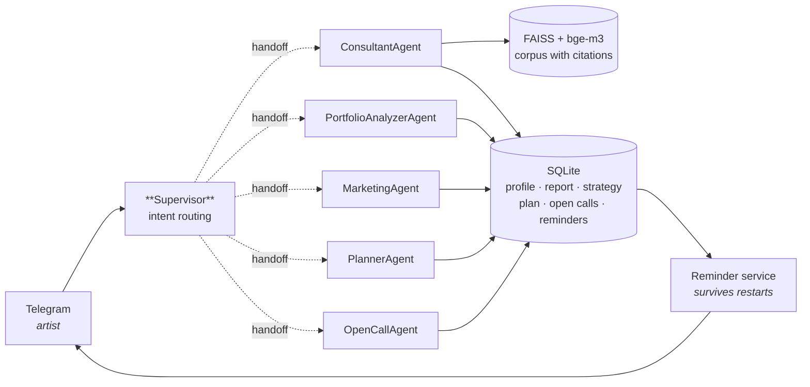

# IND-LAB Copilot

**An agentic AI copilot for visual artists.** It reads your practice, writes a marketing
strategy and a promotion plan you can actually follow, and watches open calls so you never
find out about a deadline the day after it passed — so you can spend your time making work
instead of managing a career.

🇷🇺 [Русская версия README](README.ru.md) · 🎨 [Interactive demo](https://ellavsen.github.io/Copilot/)

[](https://github.com/ellavsen/Copilot/actions/workflows/ci.yml)


---

## What it does

The copilot lives in Telegram and coordinates five specialists behind a single conversation.

| | |
|---|---|
| 🎨 **Portfolio analysis** | Reads your statement and practice, names what is strong, and turns weaknesses into tasks rather than verdicts. |
| 📈 **Marketing strategy** | Positioning, audience segments, channels and a publishing rhythm that one person can sustain while also making art. |
| 🗓 **Promotion plan** | The strategy broken into weeks, with checkpoints that reveal early whether it is working. |
| 🔔 **Open-call monitoring** | Finds residencies, grants and prizes that fit your profile, tracks deadlines and reminds you 30 / 14 / 7 / 3 / 1 days out — with the place and the link. |
| 🧠 **Progressive personalisation** | Mention your city or medium in passing and it is saved. You never repeat yourself, and every later answer uses what it knows. |
| 📚 **Grounded answers** | Art-market questions are answered from a local corpus, and every passage comes back with its source document. |

The three deliverables form a chain: the strategy is built on the portfolio analysis, the
plan on the strategy. That link is stored in the database, so the planner reads a real
strategy instead of assuming one exists.

## Architecture



Routing goes through LangGraph's own handoff tools. There is no hand-rolled router, no
JSON protocol invented on top of the framework, and one `await` per user message.

**The identity boundary.** Tools never take a `user_id` argument. The Telegram layer binds
the current artist to the async task with a `ContextVar` before the graph runs, and tools
read it from there. The model cannot see whose data it is touching and cannot choose to
touch someone else's — a property covered by a test.

## Quickstart

```bash
git clone https://github.com/ellavsen/Copilot.git
cd Copilot
python -m venv .venv && source .venv/bin/activate   # Windows: .venv\Scripts\activate
pip install -e ".[dev]"
cp .env.example .env                                 # add BOT_TOKEN and OPENAI_API_KEY
indlab-seed                                          # create the DB, load the catalogue
indlab-bot
```

Then open your bot in Telegram and send `/start`.

The core install takes seconds. Semantic search over an art-theory corpus is optional and
lives behind an extra, because it pulls in torch:

```bash
pip install -e ".[rag,ingest]"
mkdir -p data/corpus     # drop PDF / DOCX / MD files in here
indlab-ingest            # builds data/vector_db
```

Without it the copilot still works; it simply says the knowledge base is not connected
rather than pretending to cite it.

### Commands

| Command | |
|---|---|
| `indlab-bot` | Run the Telegram bot |
| `indlab-seed` | Create the database and load the open-call catalogue (idempotent) |
| `indlab-ingest` | Build the FAISS index from `data/corpus/` and, optionally, Google Drive |

## Layout

```
src/indlab/
├── agents/          supervisor graph, prompts, LLM factory, identity context
├── bot/             Telegram handlers, keyboards, profile interview
├── db/              SQLAlchemy models, async engine, repositories
├── rag/             lazy FAISS singleton, corpus ingester
├── reminders/       deadline dispatcher
├── tools/           what the agents can actually do
├── data/            bundled open-call catalogue
├── config.py        pydantic-settings
└── cli.py           console entry points
tests/               92 tests, no network, no API key required
web/                 the static demo published to GitHub Pages
```

## Tests

```bash
pytest -q          # 92 tests, ~2 seconds
ruff check src tests
```

The suite runs without an API key, without network access and without the `[rag]` extra.
It covers the persistence layer, every tool, the reminder lifecycle across a simulated
process restart, answer extraction from the agent graph, and the Cyrillic search
regression described below.

## Design decisions worth knowing

**Reminders live in the database, not in a scheduler.** An in-process job queue loses
everything on restart. Storing the schedule as rows and sweeping for what is due means a
deploy never silently drops a deadline. That is the difference between a feature you can
rely on and one you have to double-check.

**Catalogue deadlines are labelled as estimates.** Recurring competitions move their dates
every year. Seeded entries are marked unverified, rendered as *"ориентировочно … уточни на
сайте"*, and their reminders say "time to go check" rather than "hurry up". Open calls the
artist adds themselves are trusted, because they read them from the source. A reminder
that quietly points at a stale date would be worse than no reminder at all.

**SQLite's `lower()` is ASCII-only.** `lower('Живопись')` returns `'Живопись'` unchanged,
so a case-insensitive search would silently match nothing in a catalogue that is entirely
in Russian. Rather than patching the driver, each open call stores a lowercased search
field computed in Python — portable, index-friendly, and it keeps the SQL standard.

**The heavy stack is optional.** torch, transformers and faiss are roughly 2 GB. Keeping
them in an extra means the core installs in seconds, CI is fast, and contributors can run
the full test suite on a laptop.

**No authentication at all.** The artist is their Telegram account. There is no
registration, no password and therefore no password sitting in a chat log forever.

## Limitations

- **Portfolio analysis reads text, not images.** It works from the artist statement and
  profile. Vision-based analysis of the actual works is the obvious next step and is not
  implemented.
- **The open-call catalogue is a starting point,** not a live feed. It ships ~18 curated
  international programmes with real links and estimated dates. `OpenCallRepository.upsert`
  is the seam where a scraper or API adapter would plug in.
- **Single-process SQLite.** Fine for one bot instance. Multiple workers would want
  PostgreSQL; the repository layer is the only thing that would change.
- **Answers are not streamed.** The bot shows a typing indicator and replies when the
  answer is complete.

## License

MIT — see [LICENSE](LICENSE).

The bundled open-call catalogue lists real programmes with real links, but its dates are
indicative and must be confirmed with the organiser.
