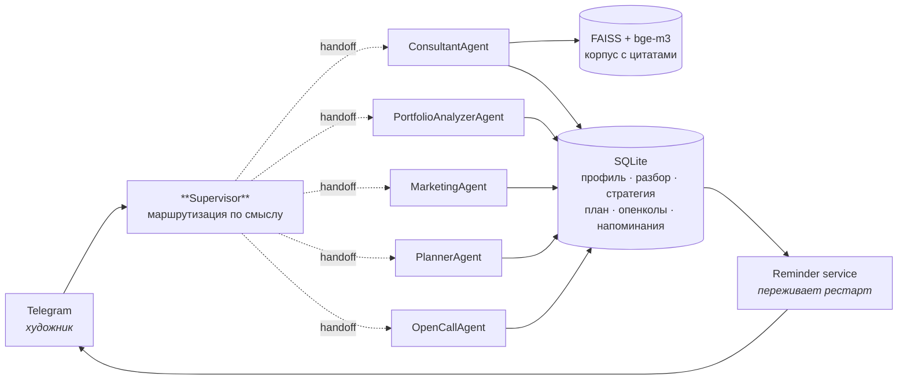

# IND-LAB Copilot

**Агентный AI-копайлот для художника.** Разбирает практику, собирает маркетинговую
стратегию и выполнимый план продвижения, следит за опенколами и напоминает о дедлайнах
заранее — чтобы время уходило на работы, а не на управление карьерой.

🇬🇧 [README in English](README.md) · 🎨 [Интерактивное демо](https://ellavsen.github.io/Copilot/)

[](https://github.com/ellavsen/Copilot/actions/workflows/ci.yml)


---

## Что он делает

Копайлот живёт в Telegram и координирует пятерых специалистов внутри одного разговора.

| | |
|---|---|
| 🎨 **Разбор портфолио** | Читает statement и практику, называет сильное и превращает слабое в задачи, а не в приговор. |
| 📈 **Маркетинговая стратегия** | Позиционирование, сегменты аудитории, каналы и ритм публикаций, который выдержит человек, который ещё и работает в мастерской. |
| 🗓 **План продвижения** | Стратегия, разложенная по неделям, с контрольными точками, на которых рано видно, работает ли это. |
| 🔔 **Мониторинг опенколов** | Находит резиденции, гранты и премии под профиль, следит за дедлайнами и напоминает за 30 / 14 / 7 / 3 / 1 день — с местом и ссылкой. |
| 🧠 **Постепенная персонализация** | Упомянула город или технику вскользь — записано. Повторяться не нужно, и каждый следующий ответ это учитывает. |
| 📚 **Ответы с источниками** | Вопросы про арт-рынок отвечаются по локальному корпусу, и каждый фрагмент возвращается с названием документа. |

Три результата связаны в цепочку: стратегия строится на разборе портфолио, план — на
стратегии. Связь хранится в базе, поэтому планировщик читает настоящую стратегию, а не
предполагает, что она есть.

## Архитектура



Маршрутизация идёт через штатные handoff-инструменты LangGraph. Никакого самодельного
роутера, никакого JSON-протокола, придуманного поверх фреймворка, — один `await` на
сообщение пользователя.

**Граница личности.** Инструменты не принимают аргумент `user_id`. Слой Telegram
привязывает текущего художника к асинхронной задаче через `ContextVar` до запуска графа, и
инструменты читают его оттуда. Модель не видит, с чьими данными работает, и не может
выбрать чужие — на это есть тест.

## Быстрый старт

```bash
git clone https://github.com/ellavsen/Copilot.git
cd Copilot
python -m venv .venv && source .venv/bin/activate   # Windows: .venv\Scripts\activate
pip install -e ".[dev]"
cp .env.example .env                                 # впиши BOT_TOKEN и OPENAI_API_KEY
indlab-seed                                          # создать БД, загрузить каталог
indlab-bot
```

Дальше — открыть бота в Telegram и отправить `/start`.

Ядро ставится за секунды. Семантический поиск по корпусу об искусстве — опциональный, он
живёт в отдельном extra, потому что тянет torch:

```bash
pip install -e ".[rag,ingest]"
mkdir -p data/corpus     # положи сюда PDF / DOCX / MD
indlab-ingest            # соберёт data/vector_db
```

Без него копайлот работает — просто честно говорит, что база знаний не подключена, вместо
того чтобы делать вид, будто ссылается на неё.

### Команды

| Команда | |
|---|---|
| `indlab-bot` | Запустить Telegram-бота |
| `indlab-seed` | Создать базу и загрузить каталог опенколов (идемпотентно) |
| `indlab-ingest` | Собрать индекс FAISS из `data/corpus/` и, опционально, из Google Drive |

## Структура

```
src/indlab/
├── agents/          граф супервизора, промпты, фабрика LLM, контекст личности
├── bot/             хендлеры Telegram, клавиатуры, интервью по профилю
├── db/              модели SQLAlchemy, асинхронный движок, репозитории
├── rag/             ленивый синглтон FAISS, загрузчик корпуса
├── reminders/       доставка напоминаний о дедлайнах
├── tools/           то, что агенты реально умеют делать
├── data/            встроенный каталог опенколов
├── config.py        pydantic-settings
└── cli.py           точки входа в консоли
tests/               92 теста, без сети и без API-ключа
web/                 статическое демо для GitHub Pages
```

## Тесты

```bash
pytest -q          # 92 теста, ~2 секунды
ruff check src tests
```

Всё идёт без ключа, без сети и без extra `[rag]`. Покрыты слой хранения, каждый
инструмент, жизненный цикл напоминаний с имитацией перезапуска процесса, извлечение
ответа из графа агентов и регрессия по кириллическому поиску — о ней ниже.

## Решения, которые стоит знать

**Напоминания лежат в базе, а не в планировщике.** Очередь задач в памяти процесса теряет
всё при рестарте. Расписание, сохранённое строками, и периодический опрос «что пора» —
это значит, что деплой никогда не проглотит дедлайн молча. Разница между функцией, на
которую можно положиться, и функцией, которую приходится перепроверять.

**Даты из каталога помечены как ориентировочные.** Ежегодные конкурсы двигают сроки
каждый год. Записи из каталога помечены непроверенными, показываются как
«ориентировочно … уточни на сайте», а напоминания по ним говорят «пора проверить приём
заявок», а не «поторопись». Опенколы, добавленные художником, считаются проверенными —
он прочитал их у источника. Напоминание, которое молча указывает на устаревшую дату,
хуже, чем отсутствие напоминания.

**SQLite `lower()` работает только с ASCII.** `lower('Живопись')` возвращает `'Живопись'`
без изменений, поэтому поиск без учёта регистра молча не находил бы ничего в каталоге,
который целиком на русском. Вместо патча драйвера каждый опенкол хранит поисковое поле в
нижнем регистре, посчитанное в Python: портируемо, дружелюбно к индексам и оставляет SQL
стандартным.

**Тяжёлый стек — опциональный.** torch, transformers и faiss — это примерно 2 ГБ. Вынести
их в extra значит, что ядро ставится за секунды, CI быстрый, а полный набор тестов
проходит на ноутбуке.

**Аутентификации нет вообще.** Художник — это его аккаунт Telegram. Нет регистрации, нет
пароля, а значит, нет и пароля, который навсегда остался в истории чата.

## Ограничения

- **Разбор портфолио читает текст, а не изображения.** Он работает по artist statement и
  профилю. Анализ самих работ vision-моделью — очевидный следующий шаг, он не реализован.
- **Каталог опенколов — стартовая подборка,** а не живая лента. В нём ~18 международных
  программ с настоящими ссылками и ориентировочными датами. `OpenCallRepository.upsert` —
  то место, куда подключается парсер или адаптер к API.
- **Однопроцессный SQLite.** Достаточно для одного экземпляра бота. Для нескольких воркеров
  нужен PostgreSQL; менять придётся только слой репозиториев.
- **Ответы не стримятся.** Бот показывает индикатор «печатает» и отвечает, когда ответ готов.

## Лицензия

MIT — см. [LICENSE](LICENSE).

Каталог опенколов содержит реальные программы с реальными ссылками, но даты в нём
ориентировочные и требуют подтверждения у организатора.
